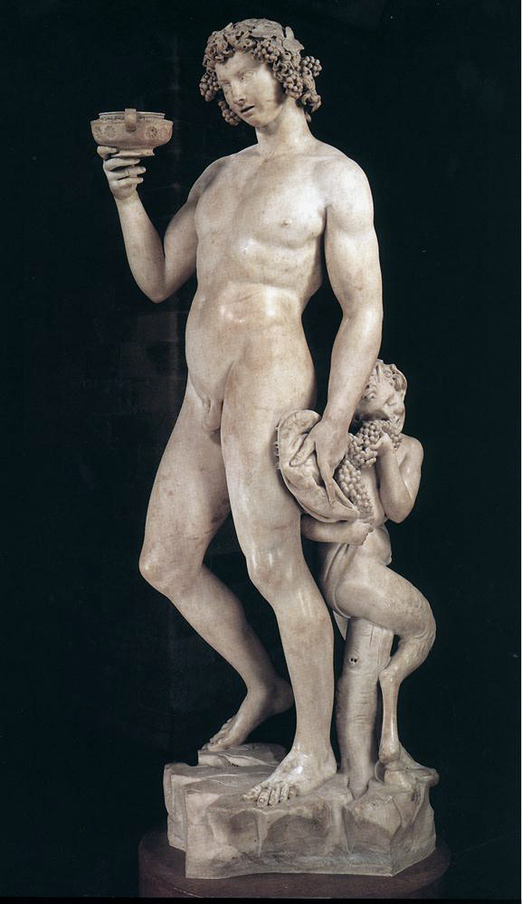

<h1>aisthesis</h1>

<blockquote>
  
<b>:: aisthesis (αἴσθησις) ::</b>

  
sensation, perception, as an opposite of intellection (noesis), understanding and pure thought; more loosely – any awareness; for Plato, some aistheseis have names, such as sights, sounds, smells, cold and heat, distress, pleasures, fears, but nameless aistheseis are countless (Theaet.156b); for Plotinus, perceptions in this world are dim intellections (noeseis), and intellections in the noetic world are vived perceptions; Philo of Alexandria postulates an Idea of aisthesis, along with an Idea of nous, in the Intellect of God (Leg.Alleg.I.21-27).

</blockquote>
